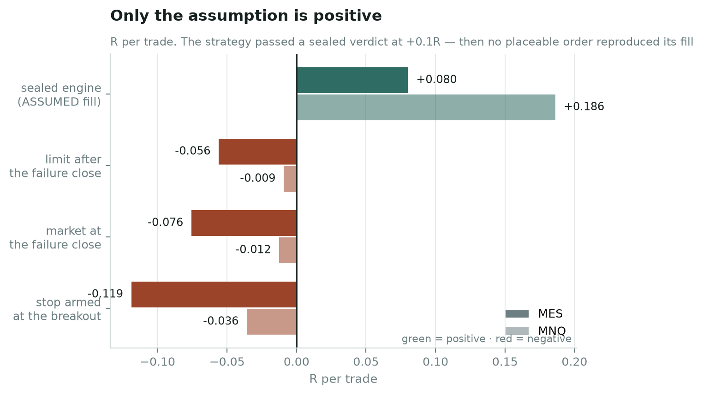

# occams-trader

A falsification lab for trading strategies. **It found nothing, and that is
the result it was built to be able to report.**

Eighteen registered hypotheses, three sealed verdicts, $128 of market data,
no fee ever paid to a funding provider, and no money ever put at risk in a
market. The conclusion is
[`docs/PROGRAMME-CONCLUSION.md`](docs/PROGRAMME-CONCLUSION.md).

The reason to read the code is not the answer. It is that **three separate
results here looked real and were not**, each was caught by a different
guard, and each guard exists because the previous one was not enough.

---

## Run it in ten seconds, with no data

```
make quickstart
```

No market data, no API key, no network. It runs the four things every
backtest should have to pass before any of its numbers are read:

| | |
|---|---|
| **positive control** | a planted edge — the harness must find it |
| **negative control** | a dead world — the harness must find nothing |
| **calibration gate** | the same measurement from two reference prices, one of which manufactures a large effect out of a market with no drift at all |
| **rule profile** | the challenge rules as dated, replaceable input |

A harness that cannot find a planted edge cannot be trusted to report its
absence either. That gate runs first, and it is the one most backtests skip.

## The three results that looked real

**An entry price no order could produce.** A strategy passed a sealed
verdict at +0.1R per trade. Then someone asked which order would have
produced that fill, and the answer was none. All four placeable orders were
negative.



**A reference price that manufactured a six-sigma effect.** A measurement
read −0.159 ATR at Cohen's *d* = −0.43 — six times its own detectable
floor, significant on both instruments, on both sides, and at both
horizons. Every robustness check passed. **94.8% of it was the reference
price:** a market that froze solid at the trigger would have printed the
same number. No significance test asks that question. A calibration gate
now does.

**A tie-handling bug in a hand-rolled statistic.** The same defect cost
nothing on one result and moved another by 28%. The difference was luck.

## What the machinery does

- **Pre-registration.** A hypothesis without a stated mechanism is rejected
  unrun. The mechanism is written before the number exists, and both
  possible directions are interpreted in advance.
- **Alpha as a depleting resource.** Not a warning you can click past: the
  evidence bar rises as the register grows, and every experiment says so
  before it runs.
- **An obtainability gate, default-deny.** A strategy declares an *order*;
  the fill is derived from what the market then did. An entry price is never
  an input, and a family with no auditor cannot be swept at all.
- **A calibration gate.** Every estimator must return ~0 on a world with no
  effect and recover the planted effect on a world that has one. Both halves
  are required — an estimator that returns zero for everything passes the
  first and is useless.
- **An append-only register** in S3 with sha256, provenance, the engine
  commit, and a `calcs.json` naming which estimator produced each number.
  Corrections append; nothing is edited.
- **A power gate that understands dependence.** Pooling two correlated
  instruments is not free. Underpowered runs are refused, not run and
  caveated.

## The rules are input

```python
from occams import profiles
p = profiles.load("profiles/example-50k.json")
profiles.assert_fresh(p, max_age_days=90)      # refuses a stale snapshot
```

The shipped profiles describe a *geometry* — account size, target, trailing
drawdown, guard — not any provider's current terms. Replace them with your
own. Profiles carry an `effective_date` and a source, and `assert_fresh`
**refuses** rather than warns: a provider retired a plan tier while its own
public pages still advertised it, and an undated rule set is a silent
expiry.

## Figures

```
make plots
```

Every number is read from the register, so a figure cannot drift from the
record it claims to show.

- [`01-feasibility-frontier`](artifacts/plots/01-feasibility-frontier.png) —
  what edge the rules actually require. Asymmetry is the lever: 2.0R needs a
  45% win rate; 1.0R needs 60–65%, which is the hardest corner on the map.
- [`02-p-pass-shape`](artifacts/plots/02-p-pass-shape.png) — a rising
  P(pass) curve is a warning, not a result. Monotonic means variance
  harvesting; an interior peak *requires* a positive edge.
- [`03-four-orders`](artifacts/plots/03-four-orders.png) — only the
  assumption is positive.

## Layout

```
occams/          the engine — rules, simulator, estimators, gates, archive
scripts/exp_*    frozen experiment scripts, archived byte-for-byte
docs/            the register's prose: verdicts, write-ups, the conclusion
profiles/        rule sets as dated, replaceable JSON
tests/           ~430, including a reproduction guard on archived results
```

```
make check       tests + lint + privacy scan + charset scan
make reproduce   re-score REAL archived results end to end (~12 min)
```

## What this is not

Not a trading system, and not a signal service. It emits no orders and
places none. There is no live-execution path in this repository and there
never was.

It is also not a claim about discretionary trading. What was tested is the
part that can be written down as a rule, which is a weaker claim than the
one people usually argue about — and that was stated before the tests ran,
not after they failed.

## Licence

**Apache License 2.0** — see [`LICENSE`](LICENSE) and [`NOTICE`](NOTICE).

Chosen over MIT for the explicit patent grant and the requirement that
modified files say they were modified. The point of publishing is that the
method is reusable and checkable; the licence should not get in the way of
the first or obscure the second.

The licensed market data used in the research is **not** redistributed here.
`data/` is git-ignored and no vendor bars or ticks are included.
