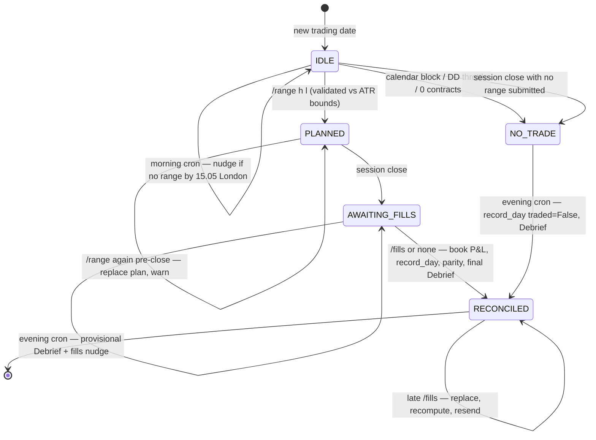

# The trading-day state machine (Phase 9.3/9.4 design — sealed 2026-07-04)

> **Revision 2026-07-31 — the closed loop.** `PLANNED` used to span the
> whole session, so nothing existed between "range known" and "session
> closed". It now splits into **CARDED → WORKING → FILLED**, which is what
> lets the poller run a card → ack → fill → exit → recap cycle and tell the
> human *when to look*. The original contract is unchanged: pure
> `transition`, enum persisted, poller/cron events are self-loops so
> repeats are idempotent by shape.
>
> **The rule that makes it safe:** a `*_touched` event may only ever emit a
> `notify_*` action. The poller sees the level trade; it does **not** know
> your fill and must never book one. A system that filled in the price it
> computed would drive drift to zero by construction and the campaign would
> measure nothing. Asserted in
> `tests/test_dayflow.py::test_poller_touch_events_never_book_a_price`.
>
> `/ack` is `placed | missed <reason> | partial <n> <reason>` — reality,
> never preference (B7-N1). There is deliberately no verb for declining a
> card on judgement.

One tiny machine per trading date. It exists because the live day is driven
by an unreliable human + retrying crons; explicit transitions make the
idempotency provable and every illegal event becomes a friendly Telegram
reply instead of a corrupted day.

**Implementation contract (no FSM library):**
- `DayPhase` enum + a **pure** function
  `transition(phase, event) -> (new_phase, actions) | Reject(reason)`.
- The persisted value in `StateStore` is the enum string per date — never a
  machine object.
- Cron events are **self-loops** → double-fires idempotent by construction.
- Late `/fills` is a **self-loop on RECONCILED** → replace + recompute +
  resend (StateStore's day-keyed semantics).
- XState rejected (JS/TS in a Python-only stack — FitnessCore steering bans
  it — and oversized for 5 flat states); Python FSM libs rejected (a
  dependency to replace ~50 lines of pure function). The diagram below is
  the visual we'd have wanted from XState, for free.

## Rejections (the UX — every one is a Telegram reply)

| Event | In state | Reply |
|---|---|---|
| `/fills` | IDLE | "no plan was issued today" |
| `/fills` | PLANNED (pre-close) | "session isn't closed yet" |
| `/range` | AWAITING_FILLS / RECONCILED | "too late for today's session" |
| `/range` | NO_TRADE (calendar) | "NO TRADE today: <reason>" |
| anything but late `/fills` | RECONCILED | "day is finalised" |

## Invariants (each becomes a TDD test in Phase 9.3/9.4)

1. Every terminal day ends RECONCILED (trade or no-trade) — the equity
   record has no holes.
2. Replaying any event sequence with cron double-fires inserted yields the
   identical end state and identical StateStore contents.
3. `ChallengeState.record_day` is called exactly once per date, at the
   RECONCILED transition.
4. All rejections leave state and store untouched.
